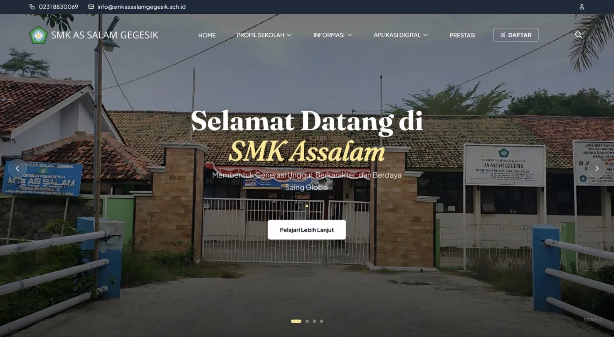
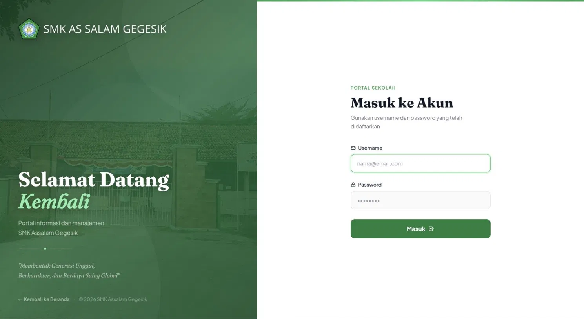
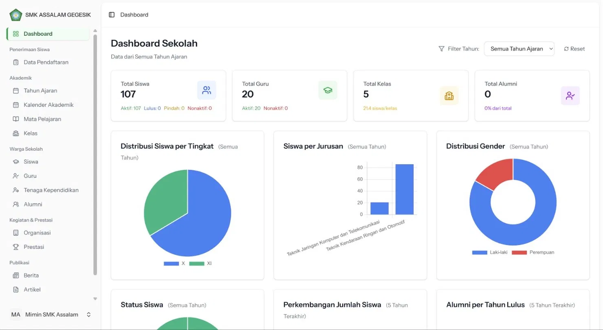
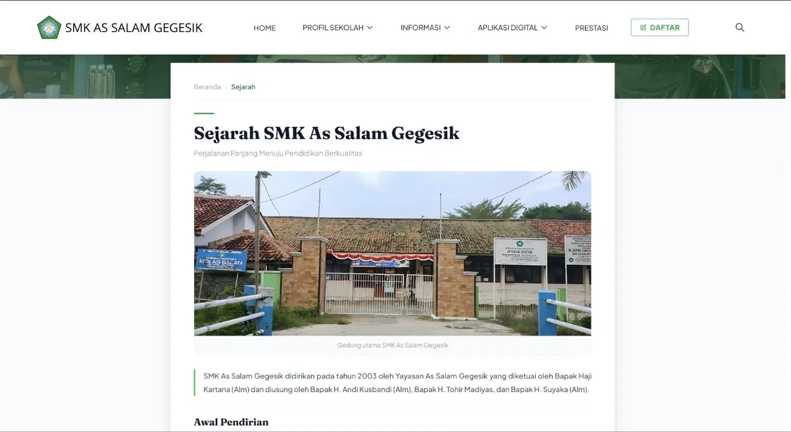
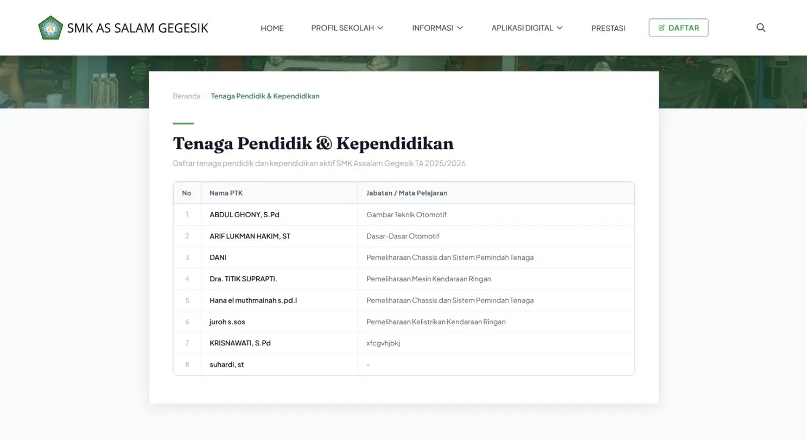
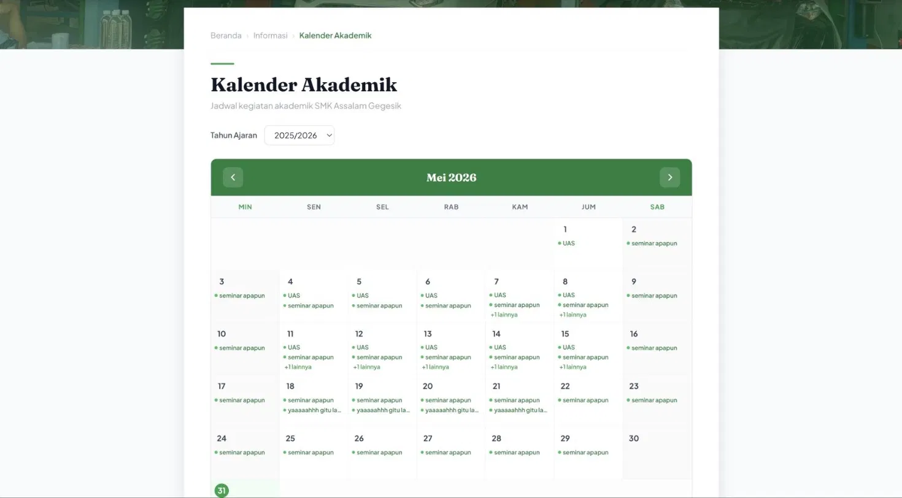
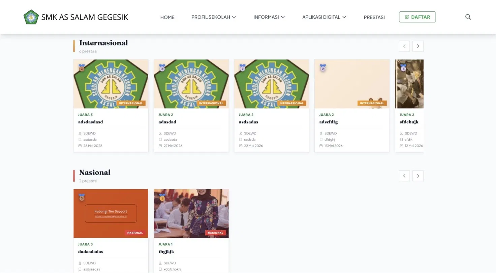

  

# 🏫 Portal Web SMK As Salam Gegesik
### Sistem Informasi & Manajemen Sekolah

**Platform web sekolah lengkap — informasi publik, pendaftaran siswa baru (PPDB), kalender akademik, berita & prestasi, hingga dashboard manajemen sekolah berbasis data.**

---

## 📸 Tampilan Aplikasi

### Landing Page

 

### Halaman Login

 

### Dashboard Admin

 

### Sejarah Sekolah

 

### Tenaga Pendidik & Kependidikan

 

### Kalender Akademik

 

### Prestasi Siswa

 

### Berita & Kegiatan

 

### Artikel

 

### Formulir Pendaftaran (PPDB)

---

## 🧠 Tentang Proyek

**Portal Web SMK As Salam Gegesik** adalah sistem informasi sekolah berbasis web yang dirancang untuk memenuhi kebutuhan digital SMK As Salam Gegesik secara menyeluruh. Platform ini menyediakan dua sisi utama: **halaman publik** untuk masyarakat dan calon siswa, serta **panel admin** untuk manajemen data sekolah secara internal.

Sistem dibangun menggunakan arsitektur **SPA (Single Page Application)** dengan Inertia.js yang menghubungkan Laravel di backend dan Vue.js di frontend, menghasilkan pengalaman pengguna yang cepat dan responsif.

---

## ✨ Fitur

**Halaman Publik**
- Landing page dengan hero slideshow dan informasi singkat sekolah
- Profil sekolah: sejarah, visi & misi, tenaga pendidik & kependidikan
- Kalender akademik interaktif per tahun ajaran
- Halaman prestasi siswa (Internasional & Nasional) dengan carousel
- Berita & kegiatan sekolah dengan kategori dan fitur pencarian
- Artikel edukasi
- Formulir pendaftaran siswa baru (PPDB) online multi-step
- Fitur pencarian global di seluruh konten
- Form pesan/kontak sekolah

**Panel Admin**
- Dashboard dengan statistik real-time: total siswa, guru, kelas, alumni
- Visualisasi: distribusi siswa per tingkat, jurusan, gender
- Manajemen PPDB: lihat, verifikasi, edit data pendaftar + export Excel & PDF
- Manajemen akademik: tahun ajaran (aktifasi), kalender, mata pelajaran, kelas
- Manajemen warga sekolah: siswa, guru, tenaga kependidikan, alumni
- Manajemen kegiatan: organisasi/ekskul dan prestasi siswa
- Manajemen publikasi: berita dan artikel (dengan slug otomatis)
- Manajemen pesan masuk dari pengunjung
- Manajemen pengguna & role (admin/user)

---

## 👥 Role Pengguna

| Role | Akses |
|------|-------|
| **Publik** | Informasi sekolah, berita, prestasi, artikel, PPDB |
| **Admin** | Kelola seluruh data: akademik, warga sekolah, prestasi, publikasi, PPDB |

---

## ⚙️ Tech Stack

| Layer | Teknologi |
|-------|-----------|
| Backend | Laravel 12 (PHP) |
| Frontend | Vue.js 3 + Tailwind CSS |
| Bridge | Inertia.js (SPA tanpa API terpisah) |
| Database | MySQL |
| Arsitektur | MVC + SPA |
| Export | Excel & PDF (PPDB) |

---

*Portal informasi dan manajemen SMK As Salam Gegesik*
*— Membentuk Generasi Unggul, Berkarakter, dan Berdaya Saing Global —*

